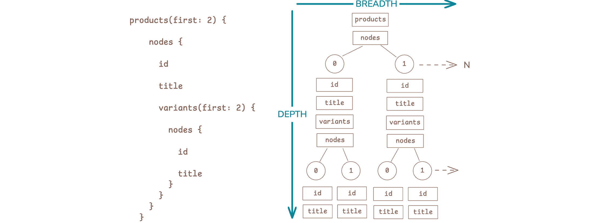
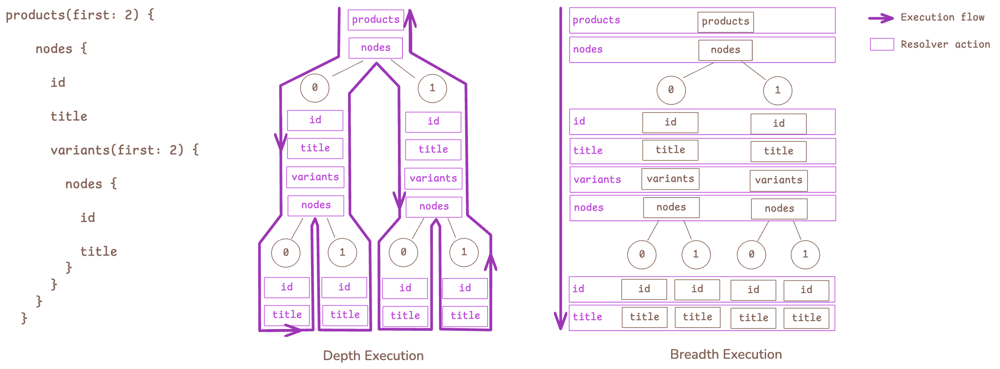
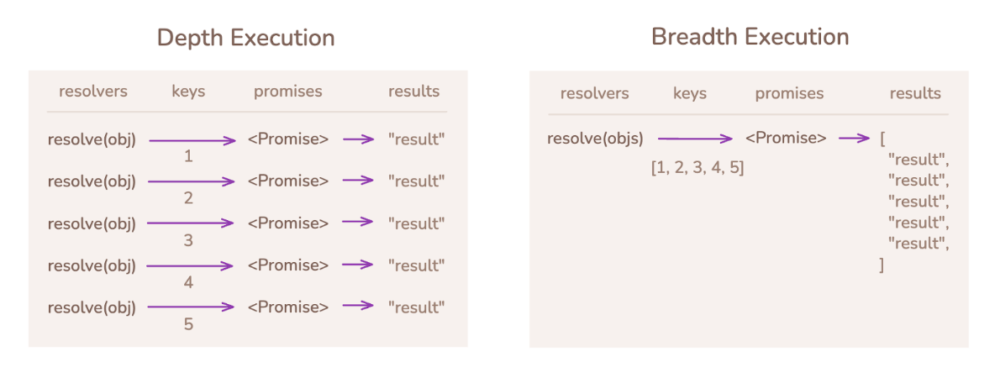

# Breadth-first GraphQL execution

_**The original prototype of the core algorithm for Shopify's _GraphQL Cardinal_ engine**_

GraphQL requests have two dimensions: _depth_ and _breadth_. The depth dimension is finite as defined by the request document, while the breadth dimension scales by the width of the response data (and can grow extremely large).



Traditional GraphQL implementations execute _depth-first_, which resolves every field of every object in the response individually, making resolver overhead (resolver calls, tracing, intermediary promises) scale by **depth × breadth**. To execute _breadth-first_, we instead resolve each selection depth only once with an aggregated breadth of objects, so resolver overhead now scales by **depth-only**.



The breadth-first design makes processing list repetitions considerably faster.

```shell
graphql-ruby (depth): 140002 resolvers
   1.087 (± 0.0%) i/s  (919.76 ms/i) -  6.000 in  5.526807s
graphql-breadth_exec 140002 resolvers
   21.314 (± 9.4%) i/s   (46.92 ms/i) -  108.000 in  5.095015s

Comparison:
graphql-breadth_exec 140002 resolvers:   21.3 i/s
graphql-ruby (depth): 140002 resolvers:   1.1 i/s - 19.60x  slower
```

## Batching advantages

Breadth-first resolvers look a little different than we're used to: they recieve `objects` and return a mapped set.

```ruby
def resolve(objects, args, cxt)
  objects.map { ... }
end
```

This means all field instances are inherently batched as a function of the engine without using DataLoader promise patterns. However, promises are still relevant for batching work _across field instances_ (ie: same field using different aliases, or different fields sharing a query, etc.), and they can be considerably more efficient in breadth execution by binding many objects to a single promise rather than generating a promise per object:



## Prototype usage

This is an extremely early prototype that demonstrates basic breadth-first concepts. It outlines the core engine flow using batched sets, and includes a basic scope-local promissory workflow. These patterns are being matured for real production use in [graphql-ruby](https://github.com/rmosolgo/graphql-ruby/pull/5509). To experiment with this prototype, you can setup a `GraphQL::BreadthExec::FieldResolver`:

```ruby
class MyFieldResolver < GraphQL::BreadthExec::FieldResolver
   def resolve(objects, args, ctx, scope)
      map_sources(objects) { |obj| obj.my_field }
   end
end
```

A field resolver provides:

* `objects`: the array of objects to resolve the field on.
* `args`: the coerced arguments provided to this selection field.
* `ctx`: the request context.
* `scope`: (experimental) a handle to the execution scope that invokes lazy hooks.

A resolver must return a mapped set of data for the provided objects. Always use the `map_sources` helper for your mapping loop to assure that exceptions are captured properly. You may return errors for a field position by mapping an `ExecutionError` into it:

```ruby
class MyFieldResolver < GraphQL::BreadthExec::FieldResolver
   def resolve(objects, args, ctx, scope)
      map_sources(objects) do |obj|
         obj.valid? ? obj.my_field : GraphQL::BreadthExec::ExecutionError.new("Object field not valid")
      end
   end
end
```

Now setup a resolver map:

```ruby
RESOLVER_MAP = {
  "MyType" => {
    "myField" => MyFieldResolver.new,
  },
  "Query" => {
    "myType" => MyTypeResolver.new,
  },
}.freeze
```

Now parse your schema definition and execute requests:

```ruby
SCHEMA = GraphQL::Schema.from_definition(%|
  type MyType {
    myField: String
  }
  type Query {
    myType: MyType
  }
|)

result = GraphQL::BreadthExec::Executor.new(
   SCHEMA,
   RESOLVER_MAP,
   GraphQL.parse(query),
   {}, # root object
   variables: { ... },
   context: { ... },
   tracers: [ ... ],
).perform
```
