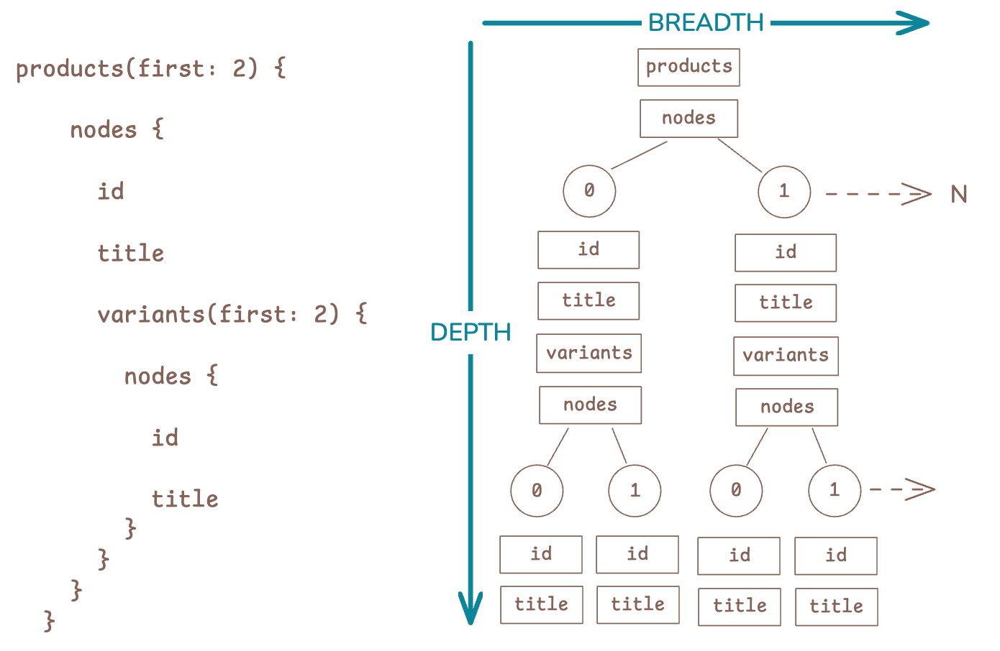
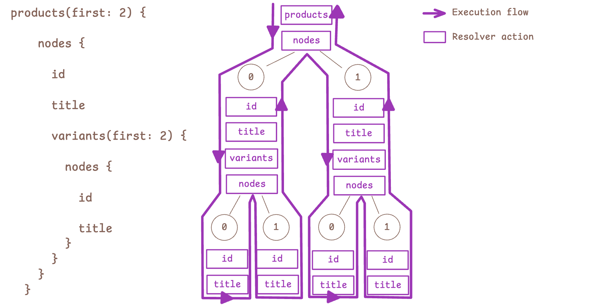
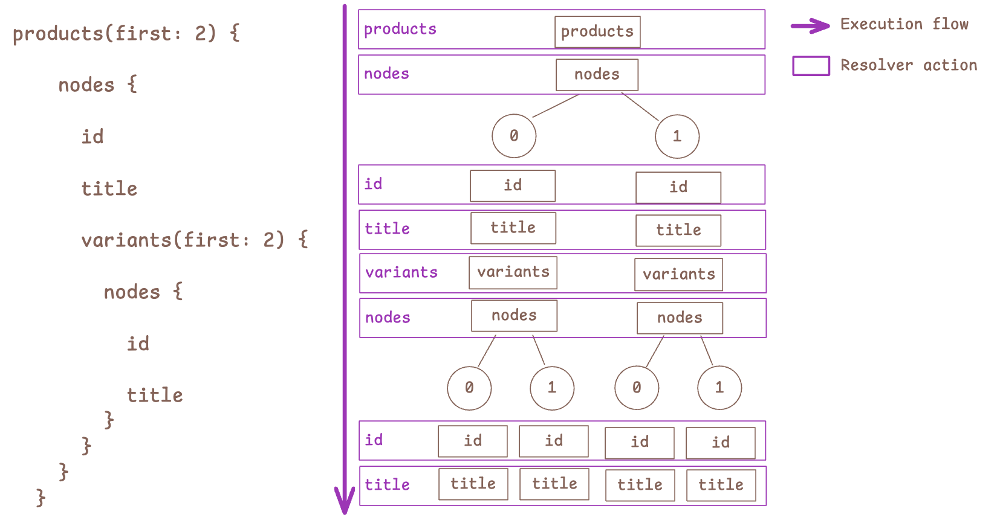

**An (experimental) breadth-first GraphQL executor written in Ruby**

Depth-first execution resolves every object field descending down a response tree, while breadth-first visits every _selection position_ once with an aggregated set of objects. The breadth-first approach is much faster due to fewer resolver calls and intermediary promises.

```shell
graphql-ruby: 140002 resolvers
   1.087 (± 0.0%) i/s  (919.76 ms/i) -  6.000 in  5.526807s
graphql-cardinal 140002 resolvers
   21.314 (± 9.4%) i/s   (46.92 ms/i) -  108.000 in  5.095015s

Comparison:
graphql-cardinal 140002 resolvers:   21.3 i/s
graphql-ruby: 140002 resolvers:   1.1 i/s - 19.60x  slower
```

### Depth vs. Breadth

GraphQL requests have two dimensions: _depth_ and _breadth_. The depth dimension is finite as defined by the request document, while the breadth dimension scales by the size of the response data (and can grow extremely large).



### Depth-first execution

Depth-first execution (the conventional GraphQL execution strategy) resolves every field in the response by descending down the selection tree of every object. This overhead scales as the response size grows, and balloons quickly with added field tracing and instrumentation.



### Breadth-first execution

Breadth-first resolvers look a little different than we're used to: they recieve `objects` and return a mapped set.

```ruby
def resolve(objects, args, cxt)
  objects.map { ... }
end
```

Breadth-first then runs a single resolver per document selection, and coalesces an array of sources to pass down to the next generation. Now resolver overhead scales by the size of the request document rather than the size of the response data.



While bigger responses will always take longer to process, the workload is your own business logic with very little GraphQL execution overhead. Other advantages:

* Eliminates boilerplate need for DataLoader promises, because resolvers are inherently batched.
* Executes via flat queuing without deep recursion and large call stacks.

## API

Setup a `GraphQL::Cardinal::FieldResolver`:

```ruby
class MyFieldResolver < GraphQL::Cardinal::FieldResolver
   def resolve(objects, args, ctx, scope)
      map_sources(objects) { |obj| obj.my_field }
   end
end
```

A field resolver provides:

* `objects`: the array of objects to resolve the field on.
* `args`: the coerced arguments provided to this selection field.
* `ctx`: the request context.
* `scope`: (experimental) a handle to the execution scope that invokes lazy hooks.

A resolver must return a mapped set of data for the provided objects. Always use the `map_sources` helper for your mapping loop to assure that exceptions are captured properly. You may return errors for a field position by mapping an `ExecutionError` into it:

```ruby
class MyFieldResolver < GraphQL::Cardinal::FieldResolver
   def resolve(objects, args, ctx, scope)
      map_sources(objects) do |obj|
         obj.valid? ? obj.my_field : GraphQL::Cardinal::ExecutionError.new("Object field not valid")
      end
   end
end
```

Now setup a resolver map:

```ruby
RESOLVER_MAP = {
  "MyType" => {
    "myField" => MyFieldResolver.new,
  },
  "Query" => {
    "myType" => MyTypeResolver.new,
  },
}.freeze
```

Now parse your schema definition and execute requests:

```ruby
SCHEMA = GraphQL::Schema.from_definition(%|
  type MyType {
    myField: String
  }
  type Query {
    myType: MyType
  }
|)

result = GraphQL::Cardinal::Executor.new(
   SCHEMA,
   RESOLVER_MAP,
   GraphQL.parse(query),
   {}, # root object
   variables: { ... },
   context: { ... },
   tracers: [ ... ],
).perform
```
